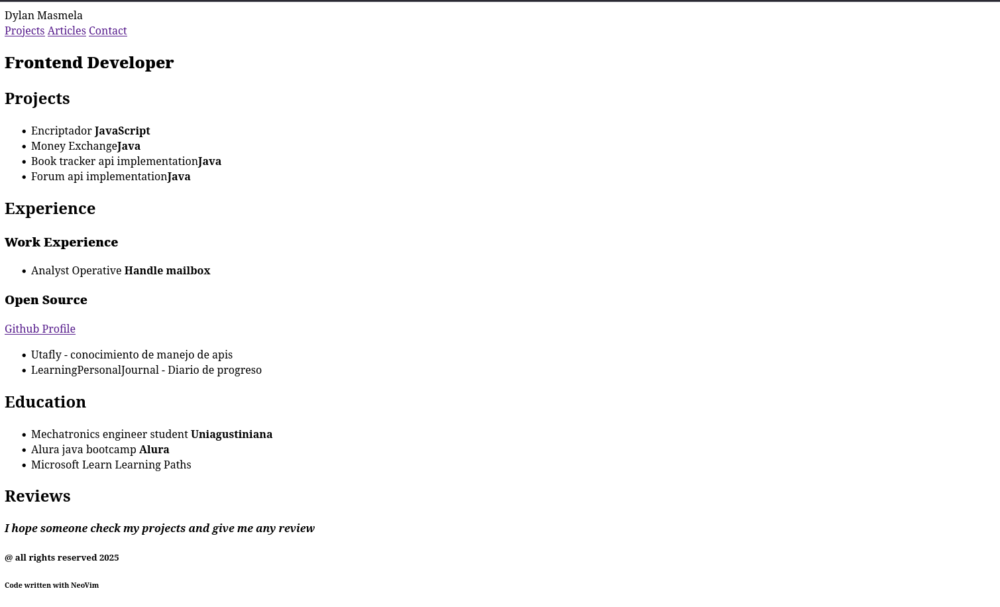
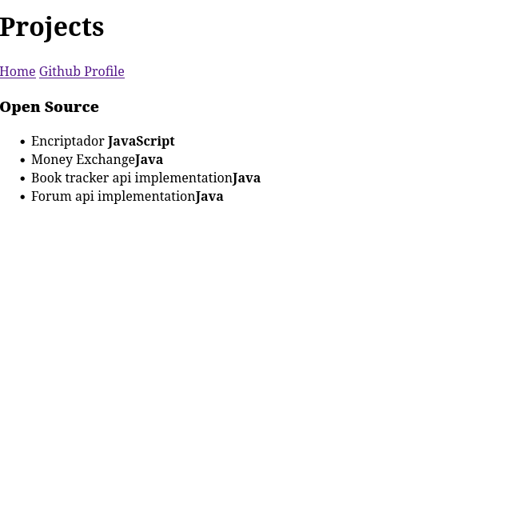
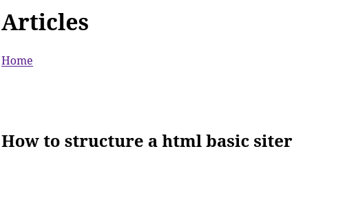
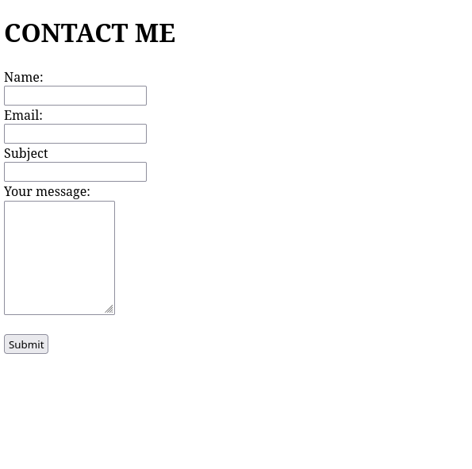

# Html CV site structure 

HTML structure of my possible CV


## SUMARY roadmap.sh

this is part of the [roadmap site]("https://roadmap.sh/projects/basic-html-website")

```
In this project, you are required to create a simple HTML only website with multiple pages. The website should have following pages:

- Homepage
- Projects
- Articles
- Contact
The website should have a navigation bar that should be present on all pages and link to all the pages.

Again, make sure that your submission includes the following:

- Semantically correct HTML structure.
- Multiple pages with a navigation bar.
- SEO meta tags in the head of each page.
- Contact page should have a form with fields like name, email, message etc.
```

# Preview

### Homepage
 

### Projects
 

### Articles
 

### Contact me 
 

